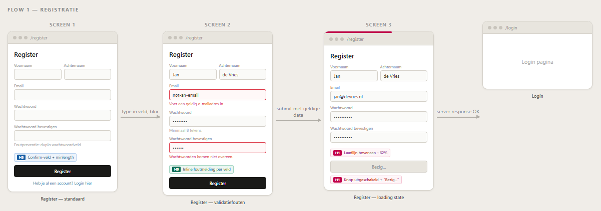
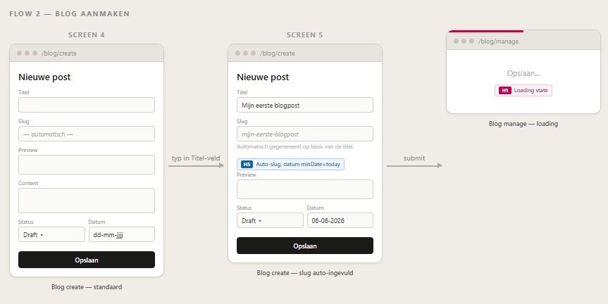
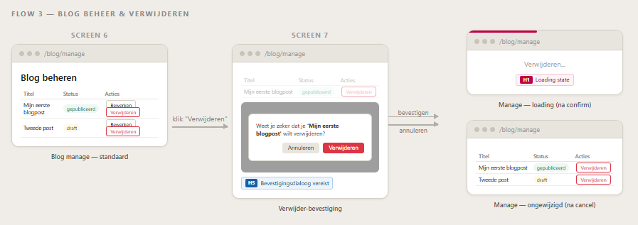
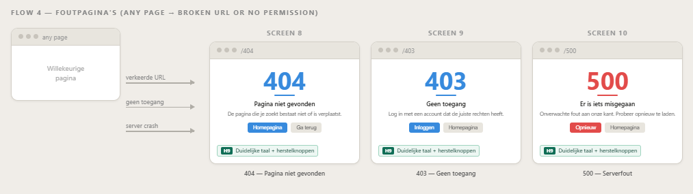

# Usability - functional design & wireflows

**Project:** ITDP-ellemaj  
**Heuristics:** H1 · H5 · H9

---

## 1. Application Overview

**Key screens in the wireflows:**

| # | Screen | Route |
|---|--------|-------|
| 1 | Register — default state | `/register` |
| 2 | Register — validation errors visible | `/register` |
| 3 | Register — submit loading state | `/register` (on submit) |
| 4 | Blog Create — default state | `/blog/create` |
| 5 | Blog Create — slug auto-filled | `/blog/create` (while typing title) |
| 6 | Blog Manage — delete confirmation dialog | `/blog/manage` |
| 7 | Any form — loading state (button disabled) | global |
| 8 | 404 error page | `/404` |
| 9 | 403 error page | `/403` |
| 10 | 500 error page | `/500` |

---

## 2. Heuristic 1 — Visibility of System Status

> *"The system should always keep users informed about what is going on, through appropriate feedback within reasonable time."*
> — Jakob Nielsen

### Where it is applied

**a) Page loading bar (all pages)**  
A small red bar animates across the very top of the screen every time the user clicks a link or submits a form. It starts at 0 % width and eases toward 88 % while the server is processing, giving continuous visual confirmation that something is happening.

**b) Submit button loading state (all forms)**  
When a form is submitted, the submit button is immediately disabled and its label changes from e.g. *"Register"* to *"Bezig..."*. This tells the user that their action was received and is being processed, and it prevents accidental double-submission.

### Motivation

Without these indicators, a user who submits a slow form sees no change on screen. They cannot tell whether their click registered, whether the server is working, or whether something went wrong. By showing immediate visual feedback — both a micro-level indicator (the button) and a macro-level indicator (the loading bar) — the system communicates its status at every stage of the interaction. This directly satisfies H1.

---

## 3. Heuristic 5 — Error Prevention

> *"Even better than good error messages is a careful design which prevents a problem from occurring in the first place."*
> — Jakob Nielsen

### Where it is applied

**a) Password confirmation field (Register page)**  
A second *"Wachtwoord bevestigen"* field was added below the password field. Both must match before the form can be submitted. This prevents the most common registration error: accidentally mistyping a password that cannot be seen.

**b) `minlength="8"` attribute on password fields**  
The browser enforces the minimum length before the form is ever sent to the server, catching the error at the earliest possible moment.

**c) Auto-slug generation (Blog Create page)**  
The *Slug* field is automatically filled from the *Titel* field as the admin types. The slug is lowercased and spaces are replaced by hyphens. This prevents typos, invalid characters, and mismatches between the title and URL. The user can still manually override the slug at any point.

**d) Date picker with minimum date (Blog Create page)**  
The publication date uses a calendar picker (flatpickr) with `minDate: "today"`, making it impossible to accidentally schedule a post in the past.

**e) Delete confirmation dialog (Blog Manage page)**  
Before a post is deleted, a modal dialog asks *"Weet je zeker dat je '[title]' wilt verwijderen?"*. The user must actively confirm. This prevents accidental, irreversible deletions.

### Motivation

Every one of these measures stops an error before it can happen. The password confirm field makes it structurally impossible to set a password you didn't intend. The auto-slug removes an entire category of URL mistakes. The date picker makes past dates unselectable. The confirmation dialog gives the user a clear off-ramp before data is destroyed. Taken together they form a layered defence that reduces the chance of user error without restricting freedom.

---

## 4. Heuristic 9 — Help Users Recognize, Diagnose, and Recover from Errors

> *"Error messages should be expressed in plain language (no codes), precisely indicate the problem, and constructively suggest a solution."*
> — Jakob Nielsen

### Where it is applied

**a) Inline form validation (Register page)**  
When a user leaves a field that contains invalid data, a short error message appears directly beneath that field in red:

| Field | Error message |
|-------|---------------|
| Voornaam / Achternaam | *"Voornaam is verplicht."* |
| Email | *"Voer een geldig e-mailadres in."* |
| Wachtwoord | *"Wachtwoord moet minimaal 8 tekens zijn."* |
| Wachtwoord bevestigen | *"Wachtwoorden komen niet overeen."* |

The invalid field itself gets a red border so the user can spot the problem at a glance. The message disappears as soon as the user starts correcting the value.

**b) Improved error pages (404 · 403 · 500)**  
All three error pages were rewritten in plain Dutch, explain what happened, and offer two recovery buttons:

| Page | Explanation | Recovery buttons |
|------|-------------|-----------------|
| 404 | *"De pagina die je zoekt bestaat niet of is verplaatst."* | Naar homepagina · Ga terug |
| 403 | *"Je hebt geen toegang. Log in met een account dat de juiste rechten heeft."* | Inloggen · Naar homepagina |
| 500 | *"Er is een onverwachte fout opgetreden aan onze kant. Probeer opnieuw te laden."* | Opnieuw proberen · Naar homepagina |

### Motivation

A bare HTTP status code tells a user nothing actionable. The previous error pages said only *"Internal error"* or *"Forbidden"* — a user would not know whether to log in, go back, or contact support. By adding a plain-language explanation and concrete recovery buttons, the user can immediately understand what went wrong and know exactly what to do next. The inline validation errors on the register form give the same benefit at a micro level: instead of a generic toast saying *"Vul alle velden in"*, the user sees exactly which field has a problem and why — right next to the field they need to fix.

---

## 5. Wireflows

### 5.1 Registration wireflow

### 5.2 Blog CRUD wireflow - create a blog

### 5.3 Blog CRUD wireflow - delete a blog

### 5.4 Errorpage wireflow - 404, 403 and 500
